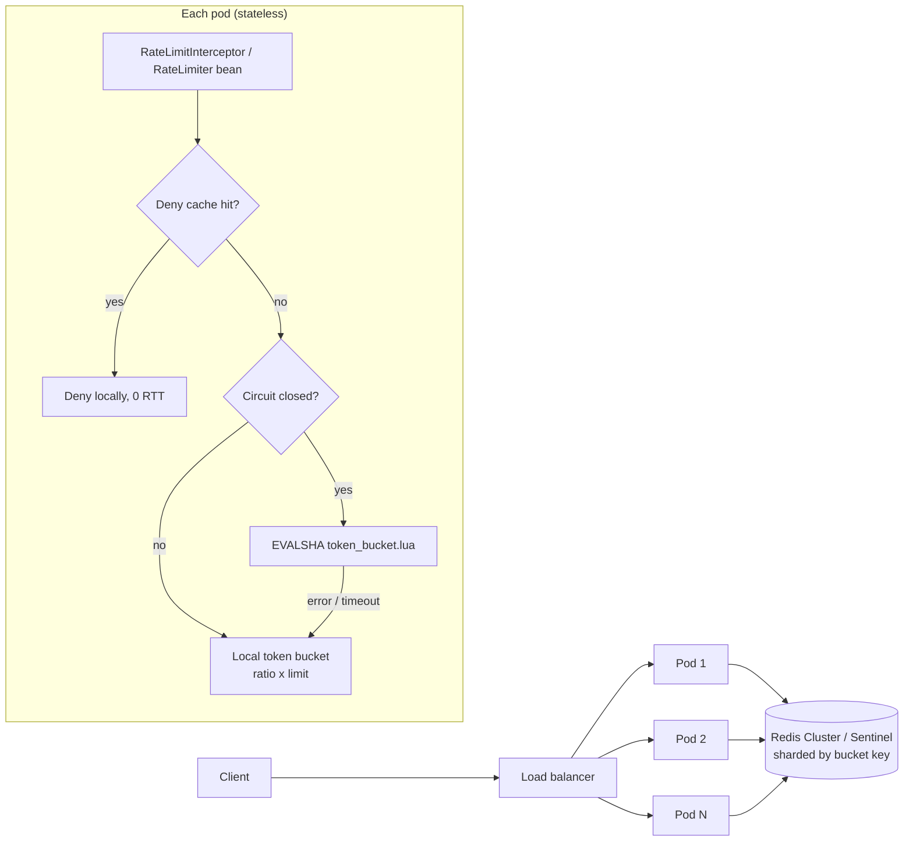

# Redis Token-Bucket Rate Limiter for Spring Boot

A distributed, fail-safe rate limiter delivered as a **Spring Boot starter**. One atomic Lua script in Redis, one network round trip per check, and a fallback chain that keeps your API serving even when Redis is gone.

[](https://github.com/<your-username>/redis-rate-limiter/actions)
  

## Why

| Goal | How it's met |
|---|---|
| **Correct across many pods** | Read-refill-consume happens inside one Lua script, so it is atomic in Redis. No races, no `WATCH/MULTI` retries. |
| **Low latency** | 1 round trip (`EVALSHA`), O(1) work, ~104 bytes/bucket. Repeat offenders are answered from a local deny cache with 0 round trips. |
| **No single point of failure** | App instances are stateless; Redis runs as Cluster or Sentinel; if Redis still fails, a circuit breaker switches to a per-pod in-memory limiter. |
| **Never throws** | Every path is wrapped; the worst case is a documented fallback decision, never an exception in your request thread. |
| **No clock skew** | Time comes from Redis `TIME`, not from each pod. |
| **Observable** | Micrometer metrics for decisions, Redis latency, errors and circuit state. |

## Quick start (under 5 minutes)

```bash
git clone https://github.com/<your-username>/redis-rate-limiter.git && cd redis-rate-limiter
docker compose up -d                 # Redis 7.4 on :6379
mvn -q -DskipTests install
mvn -q -pl sample-app spring-boot:run

# burst of 10 allowed, then 429s, refilling at 5/s
for i in $(seq 1 15); do curl -s -o /dev/null -w "%{http_code} " localhost:8080/api/hello; done; echo
curl -i localhost:8080/api/hello      # see X-RateLimit-* and Retry-After headers
```

## Usage

Add the dependency:

```xml
<dependency>
  <groupId>io.github.abhisheksharma</groupId>
  <artifactId>rate-limiter-spring-boot-starter</artifactId>
  <version>1.0.0</version>
</dependency>
```

### Declarative (Spring MVC)

```java
@RateLimit(capacity = 10, refillPerSecond = 5)                         // per client IP
@GetMapping("/api/hello")
public Map<String, String> hello() { ... }

@RateLimit(name = "merchant-orders", capacity = 100, refillPerSecond = 50,
           key = "#pathVars['merchantId']")                             // per path variable
@GetMapping("/api/merchants/{merchantId}/orders")
public Orders orders(@PathVariable String merchantId) { ... }

@RateLimit(capacity = 50, refillPerSecond = 10, permits = 5,           // weighted request
           key = "#request.getHeader('X-User-Id') ?: #ip")
@PostMapping("/api/reports")
public Status report() { ... }
```

Denied requests get `429 Too Many Requests`, a `Retry-After` header and a small JSON body. The controller is not invoked.

SpEL variables in `key`: `#request`, `#ip`, `#pathVars`, `#method`. Expressions run in a restricted `SimpleEvaluationContext` (no type references, no bean access).

### Programmatic (anywhere: Kafka consumers, gRPC, schedulers)

```java
RateLimitDecision d = rateLimiter.tryAcquire("export:" + userId, BucketConfig.perMinute(30));
if (!d.allowed()) { /* back off for d.retryAfterMillis() */ }

rateLimiter.tryAcquireAsync("tenant:" + id, BucketConfig.perSecond(200))
           .thenAccept(decision -> ...);   // future always completes normally
```

`RateLimitDecision` = `allowed`, `remaining`, `retryAfterMillis` (`-1` if `permits > capacity`), `limit`, and `source` (`REDIS`, `DENY_CACHE`, `LOCAL_FALLBACK`, `FAIL_OPEN`, `FAIL_CLOSED`, `DISABLED`).

## Architecture



### The algorithm (inside Redis, atomically)

```
now     = redis TIME (µs)
tokens  = min(capacity, tokens + (now - ts) * rate)
if permits <= tokens: tokens -= permits; HSET; PEXPIRE(time to full + 1s); allow
elif permits > capacity: deny, retry = -1
else: deny, retry = ceil((permits - tokens) / rate)          -- no write on deny
```

State per bucket is a hash `{t: tokens, ts: micros}`. See [`token_bucket.lua`](rate-limiter-spring-boot-starter/src/main/resources/ratelimiter/token_bucket.lua).

### Design decisions

1. **Lua over `MULTI/WATCH` or client-side math.** One round trip, no optimistic-lock retries under contention, and correctness doesn't depend on client clocks.
2. **Redis `TIME`, not `System.currentTimeMillis()`.** Pods with skewed clocks would otherwise mint or burn tokens. Safe for replication because Redis 5+ replicates script *effects*, not the script.
3. **No write on deny.** `(tokens, ts)` projects to the same future state whether or not we persist the refill, so rejected floods cost zero writes and zero replication traffic.
4. **Single key per bucket.** Works on Redis Cluster without hash tags; buckets spread across all shards, so throughput scales horizontally with shard count.
5. **Self-expiring keys.** TTL = time to refill fully + 1s. An expired bucket is indistinguishable from a full one, so expiry never changes a decision. Pair with `maxmemory-policy volatile-ttl`.
6. **Deny cache.** If Redis says "K can't serve P permits for R ms", that's a hard lower bound (tokens only accrue at `rate`, other pods only consume). So requests for `>= P` permits during that window are denied locally. It can never over-admit, and it keeps abusive clients off Redis.
7. **Circuit breaker before timeouts.** A dead Redis would otherwise cost a full command timeout on every request. Once open, fallback costs nanoseconds; a single probe tests recovery.
8. **Fallback is configurable.** `LOCAL` (default) keeps enforcing roughly `ratio × limit` per pod; `ALLOW` favours availability; `DENY` favours protection (e.g. login/OTP endpoints).

### Failure modes

| Failure | Behaviour | Added latency |
|---|---|---|
| Redis slow | Command times out (`spring.data.redis.timeout`, default here 50 ms) → fallback | ≤ timeout, only until circuit opens |
| Redis down | N failures open the circuit → local fallback | ~0 while open |
| Redis primary failover | Sentinel/Cluster promotes replica; a few in-flight calls fall back | brief |
| Replica promoted with lag | Some buckets may be slightly fuller than reality for a moment (over-admit, never under-admit) | none |
| Bad SpEL / bug in key resolution | Logged, request allowed (fail-open) | none |
| Memory pressure | Keys have TTLs; `volatile-ttl` evicts the soonest-to-expire (near-full buckets) first | none |

## Configuration

```yaml
spring.data.redis:
  timeout: 50ms            # sync path latency budget
  connect-timeout: 200ms
  lettuce.pool.enabled: false   # one multiplexed connection is fastest for EVALSHA
  # cluster.nodes: ...  or  sentinel.master / sentinel.nodes: ...

ratelimiter:
  enabled: true            # false => no-op limiter (allows all)
  key-prefix: rl
  fallback: LOCAL          # LOCAL | ALLOW | DENY
  async-timeout: 50ms
  local:
    ratio: 1.0             # set ~1/instances so the fleet stays near the global limit
    max-keys: 100000
    idle-expiry: 10m
  deny-cache:
    enabled: true
    max-keys: 100000
    max-ttl: 1m
  circuit-breaker:
    failure-threshold: 5
    open-duration: 5s
  web:
    enabled: true
    headers: true
    trust-forwarded-for: false   # only true behind a proxy you control
```

## Metrics

| Meter | Tags | Use |
|---|---|---|
| `ratelimiter.decisions` | `result`, `source` | allow/deny rates; alert on `source=LOCAL_FALLBACK` |
| `ratelimiter.redis.latency` | – | p50/p99 of the Lua call |
| `ratelimiter.redis.errors` | – | Redis exceptions/timeouts |
| `ratelimiter.circuit.state` | – | 0 closed, 1 half-open, 2 open |

## Benchmarks

Three layers, from Redis-only to end-to-end:

```bash
./benchmarks/redis-lua-benchmark.sh localhost 6379                    # Lua script cost in Redis
mvn -q -DskipTests package && java -jar benchmarks/target/benchmarks.jar   # JMH: library overhead
k6 run benchmarks/k6/load-test.js                                     # HTTP end-to-end
```

Baseline for the Lua script on a 1 vCPU sandbox (client and Redis sharing the core, so pessimistic):

| Scenario | Throughput | p50 | p99 |
|---|---|---|---|
| Plain `GET` | ~113k ops/s | 0.29 ms | – |
| `EVALSHA`, one hot bucket | ~60k ops/s | 0.73 ms | 1.48 ms |
| `EVALSHA`, 100k buckets | ~50k ops/s | 0.95 ms | 1.84 ms |
| 100k buckets, pipeline 16 | ~91k ops/s | – | – |

Correctness: 2,000 concurrent requests against a 1,000-token bucket admitted exactly 1,000. Details in [`benchmarks/results`](benchmarks/results/redis-lua-baseline.md). Run the suite on your hardware and replace these numbers.

## Project layout

```
rate-limiter-spring-boot-starter/   the library (auto-configured)
  core/          RateLimiter API, BucketConfig, RateLimitDecision
  redis/         RedisTokenBucketRateLimiter + Lua script
  local/         in-memory token bucket (fallback)
  resilience/    CircuitBreaker, DenyCache
  web/           @RateLimit, interceptor, SpEL key resolver
  metrics/       Micrometer bindings
sample-app/      demo Spring Boot service
benchmarks/      JMH, redis-benchmark script, k6
docs/DESIGN.md   deeper design notes and trade-offs
```

## Testing

```bash
mvn verify   # unit tests + Testcontainers integration tests (needs Docker)
```

Integration tests cover: exact admission under 64 threads across 4 simulated pods, refill, deny cache, async API, and "Redis is down" (no exception, local fallback, circuit opens).

## Roadmap

- Token leasing: pods pre-fetch small batches of tokens for ultra-hot keys, trading a little precision for fewer round trips.
- Sliding-window-log and GCRA strategies behind the same `RateLimiter` interface.
- Spring Cloud Gateway / WebFlux filter.
- Dynamic per-tenant limits loaded from config server.

## Contributing

Issues and PRs are welcome. Please run `mvn verify` before opening a PR.

## License

MIT
